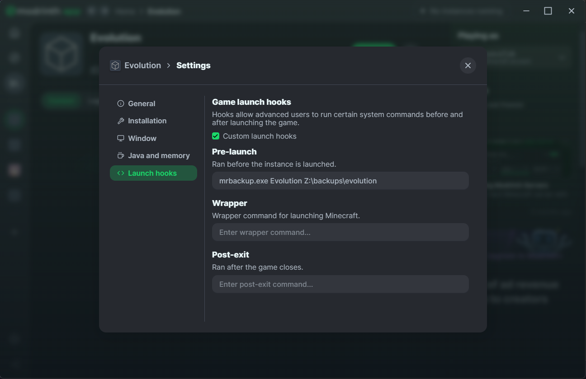

# mrbackup

A simple little tool to create backups of your modrinth profiles.

## Usage

```
Usage: mrbackup [--filename-format FILENAME-FORMAT] [--install-dir INSTALL-DIR] [--log-level LOG-LEVEL] PROFILE TARGET

Positional arguments:
  PROFILE                The profile to back up
  TARGET                 Target path for backup files

Options:
  --filename-format FILENAME-FORMAT, -f FILENAME-FORMAT
                         Format of the file name [default: {{.Profile.Name}}_{{.Profile.GameVersion}}_{{.Timestamp}}.zip, env: FILENAME_FORMAT]
  --install-dir INSTALL-DIR
                         Custom Modrinth install directory [env: MODRINTH_DIR]
  --log-level LOG-LEVEL, -l LOG-LEVEL
                         Log level [default: info]
  --help, -h             display this help and exit
```

Simply add a pre-launch hook to your Modrinth profile as following and your profile will be automatically backed up before each launch of your profile.



## Installation

Simply download the latest release for your system from the [Releases](https://github.com/zekroTJA/mrbackup/releases) page.

Otherwise, if you have the Go toolchain installed, you can also build and install it from the sources.
```
go install github.com/zekrotja/mrbackup/cmd/mrbackup@latest
```